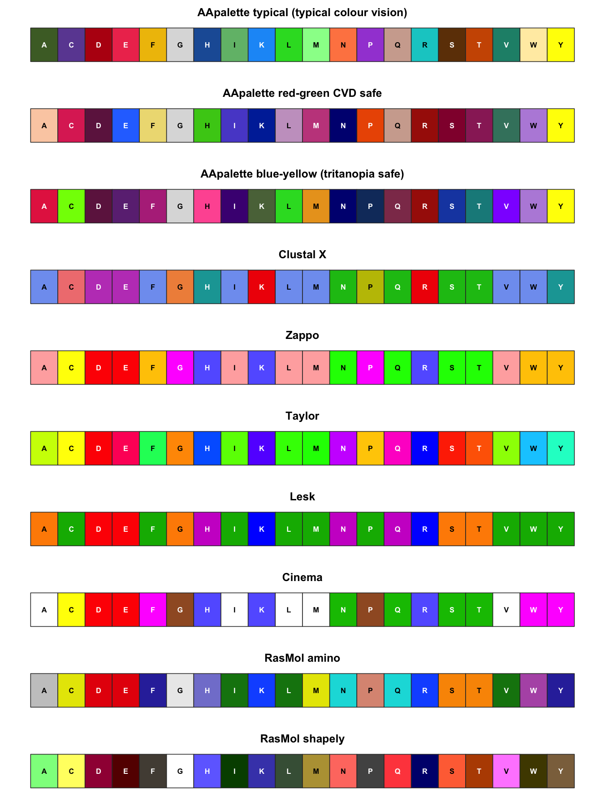
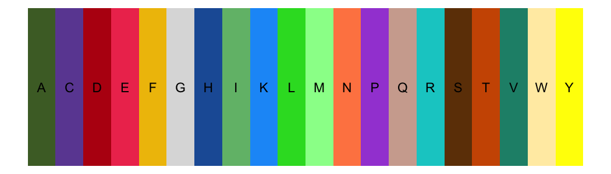

<!-- README.md is generated from README.Rmd. Please edit that file -->

# aapalette

<!-- aapalette logo (shields.io coloured residues) -->


<!-- badges: start -->
<!-- badges: end -->

**aapalette** provides a curated set of amino-acid colour palettes for
protein sequence figures in R. Every colour is loaded from a single
bundled JSON source of truth (`inst/extdata/aa_palettes.json`), so the
R, Python (`pyaapalette`) and Jalview (`jalaapalette`) siblings ship
identical scheme IDs, hex values and residue handling.

## Installation

``` r
# install.packages("remotes")
remotes::install_github("aapalette/aapalette")
```

## The schemes

Three palettes are **new**, from the AApalette amino-acid colour
alphabet (this project):

| ID           | For                                            | Released  |
|--------------|------------------------------------------------|-----------|
| `typical`    | typical colour vision                          | CC-BY-4.0 |
| `redgreen`   | deuteranopia & protanopia (red-green CVD) safe | CC-BY-4.0 |
| `blueyellow` | tritanopia safe                                | CC-BY-4.0 |

Seven are **community-standard** schemes, reproduced and attributed:

| ID        | Source                                              |
|-----------|-----------------------------------------------------|
| `clustal` | Clustal X / Jalview                                 |
| `zappo`   | Zappo / Jalview                                     |
| `taylor`  | Taylor (1997) / Jalview                             |
| `lesk`    | Lesk, *Introduction to Protein Architecture*        |
| `cinema`  | CINEMA (Parry-Smith *et al.* 1998)                  |
| `rasmol`  | RasMol amino colour scheme                          |
| `shapely` | RasMol / Jmol shapely (Fletterick *Shapely* models) |

``` r
library(aapalette)
aa_schemes()
#>            id                                     label
#> 1     typical AApalette typical (typical colour vision)
#> 2    redgreen              AApalette red-green CVD safe
#> 3  blueyellow   AApalette blue-yellow (tritanopia safe)
#> 4     clustal                                 Clustal X
#> 5       zappo                                     Zappo
#> 6      taylor                                    Taylor
#> 7        lesk                                      Lesk
#> 8      cinema                                    Cinema
#> 9      rasmol                              RasMol amino
#> 10    shapely                            RasMol shapely
#>                                 kind                         vision
#> 1  identity (one colour per residue)          typical colour vision
#> 2                           identity deuteranopia & protanopia safe
#> 3                           identity                tritanopia safe
#> 4                    property groups          typical colour vision
#> 5                    property groups          typical colour vision
#> 6                           identity          typical colour vision
#> 7                    property groups          typical colour vision
#> 8                    property groups          typical colour vision
#> 9                    property groups          typical colour vision
#> 10                          identity          typical colour vision
#>                                             source
#> 1                            This work (aapalette)
#> 2                            This work (aapalette)
#> 3                            This work (aapalette)
#> 4                              Clustal X / Jalview
#> 5                                  Zappo / Jalview
#> 6                          Taylor (1997) / Jalview
#> 7       Lesk, Introduction to Protein Architecture
#> 8                 CINEMA (Parry-Smith et al. 1998)
#> 9                       RasMol amino colour scheme
#> 10 RasMol/Jmol shapely (Fletterick Shapely models)
```

## Usage

Get a palette as a named character vector in canonical residue order
(`A C D E F G H I K L M N P Q R S T V W Y`):

``` r
aa_palette("typical")
#>         A         C         D         E         F         G         H         I 
#> "#4C6B30" "#6C4BA1" "#B81212" "#EE3B5C" "#EFBF04" "#DCDCDC" "#1E5DA5" "#71BC78" 
#>         K         L         M         N         P         Q         R         S 
#> "#1B9AF7" "#2ADB2A" "#98FB98" "#FF8651" "#A44DD7" "#D0AB9D" "#00CCCC" "#6E3D06" 
#>         T         V         W         Y 
#> "#CD5700" "#1F8F78" "#FFECB1" "#FFFF00"
```

Optionally append the documented defaults for unknown/ambiguous codes
and gaps:

``` r
aa_palette("clustal", include_unknown = TRUE, include_gap = TRUE)
#>         A         C         D         E         F         G         H         I 
#> "#80A0F0" "#F08080" "#C048C0" "#C048C0" "#80A0F0" "#F09048" "#15A4A4" "#80A0F0" 
#>         K         L         M         N         P         Q         R         S 
#> "#F01505" "#80A0F0" "#80A0F0" "#15C015" "#C0C000" "#15C015" "#F01505" "#15C015" 
#>         T         V         W         Y         X         B         Z         J 
#> "#15C015" "#80A0F0" "#80A0F0" "#15A4A4" "#BEBEBE" "#BEBEBE" "#BEBEBE" "#BEBEBE" 
#>         -         . 
#> "#FFFFFF" "#FFFFFF"
```

Scheme metadata, including the CIEDE2000 ΔE minima for the CVD-aware
palettes:

``` r
aa_scheme_info("redgreen")$min_deltaE
#> $normal
#> [1] 9.3
#> 
#> $deutan
#> [1] 7.4
#> 
#> $protan
#> [1] 6.8
#> 
#> $tritan
#> [1] 4.7
```

Look up colours for an arbitrary sequence (lower-case, unknown codes and
gaps are handled automatically):

``` r
aa_colour(strsplit("ACDEKR-X", "")[[1]], "typical")
#> [1] "#4C6B30" "#6C4BA1" "#B81212" "#EE3B5C" "#1B9AF7" "#00CCCC" "#FFFFFF"
#> [8] "#BEBEBE"
```

### Swatches

``` r
op <- par(mfrow = c(10, 1))
for (id in aa_schemes()$id) plot_aa_palette(id)
```



``` r
par(op)
```

### ggplot2

`scale_colour_aa()` / `scale_color_aa()` and `scale_fill_aa()` are
discrete manual scales keyed on residue letters. Unknown residues and
gaps fall back to the documented defaults.

``` r
library(ggplot2)
df <- data.frame(residue = factor(names(aa_palette("typical"))), x = 1:20, y = 1)
ggplot(df, aes(x, y, fill = residue, label = residue)) +
  geom_tile() +
  geom_text() +
  scale_fill_aa("typical") +
  theme_void() +
  theme(legend.position = "none")
```



## Recommended schemes

``` r
aa_recommended()
#>        normal red_green_cvd    tritan_cvd 
#>     "typical"    "redgreen"  "blueyellow"
```

Use **`typical`** for typical colour vision, **`redgreen`** for
red-green colour-vision deficiency, and **`blueyellow`** for tritanopia.

## Colour-vision caveat

> No 20-colour palette is safe for all deficiencies at once; for robust
> figures pair colour with the residue letter (redundant coding). ΔE
> values are CIEDE2000 minima.

The swatch helper labels every residue precisely to encourage this
redundant coding.

## Deliberate exclusions

Polychrome, Green-Armytage, and Biotite/Gecos (flower/blossom/sunset)
palettes, and any personal/agent palettes, are intentionally **not**
included.

## Licences & attribution

- **Code:** MIT (see `LICENSE` / `LICENSE.md`).
- **Colour data:** the palettes in `inst/extdata/aa_palettes.json` —
  including the new `typical`, `redgreen` and `blueyellow` palettes —
  are released under **CC-BY-4.0** (see
  `inst/extdata/LICENSE-CC-BY-4.0.txt`).

If you use the new palettes, please cite the AApalette amino-acid colour
alphabet:

> AApalette: a property-coherent, colour-vision-aware amino-acid colour
> alphabet. *Methods write-up forthcoming* (placeholder citation), 2026.

The classical schemes are attributed to their original sources as listed
in the table above and in each scheme’s `source` field.

## Data provenance

The bundled `inst/extdata/aa_palettes.json` is the single source of
truth and is copied verbatim from the project-root `aa_palettes.json`.
Never edit hex values by hand; see `data-raw/regenerate.R` to refresh
the bundled copy. The test suite asserts that the package’s palettes
equal the JSON exactly.
